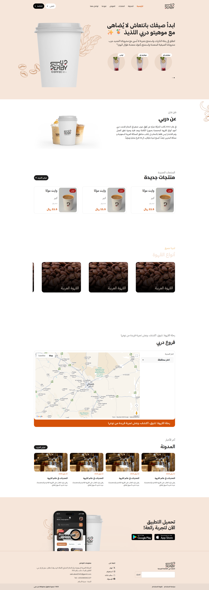

# Derby Coffee - Landing Page for a Specialty Coffee Brand

✦ A modern, clean, and fully responsive landing page for **"Derby Coffee"**, a premium coffee brand that started its journey in Dammam and expanded across Saudi Arabia and Bahrain! ✦

## 🚀 Live Demo
[Check out the live demo here](https://zaki-abed.github.io/derby/)

---

## 📸 Screenshots

### 🏠 Landing Page

---

## ✅ Features

- Modern, mobile-responsive design
- Highlights our story, products, and branches
- Sections for menu, locations, and customer testimonials
- Easy-to-access contact and franchise inquiry forms

---

## 🛠️ Tech Stack

- HTML5 / CSS3 / JavaScript
- Fully responsive across devices
- Optimized for local and regional search engines

---

## 🎯 Goal

To share Derby Coffee’s journey from a humble shop to a leading coffee brand, making it easy for customers to discover our branches and experience the taste of premium roasted coffee.

---

## 📬 Contact

Want to learn more or explore partnership opportunities?  
Visit our website or reach out to us through our official contact channels.

---
